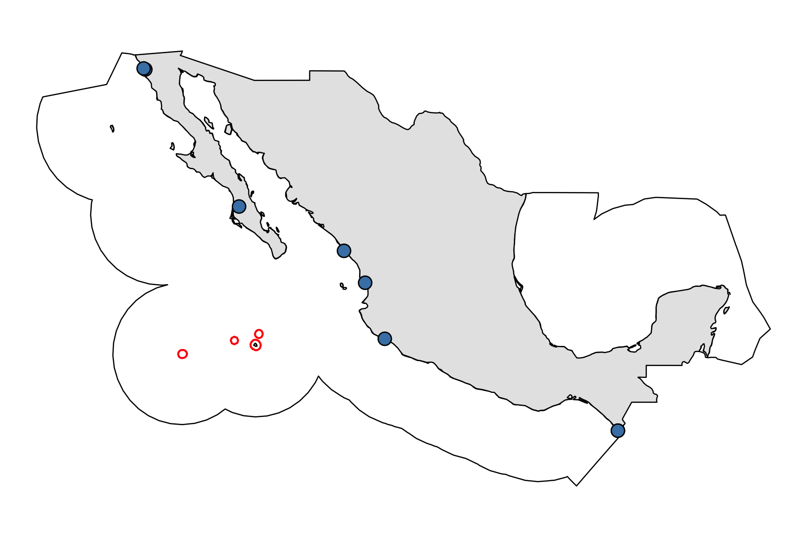
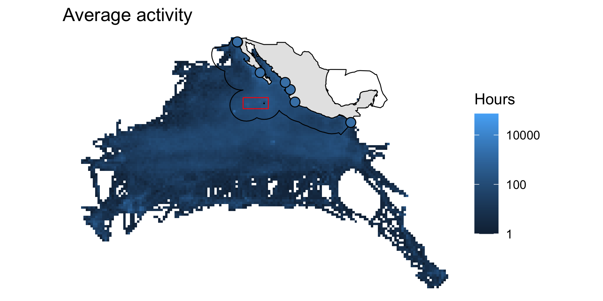
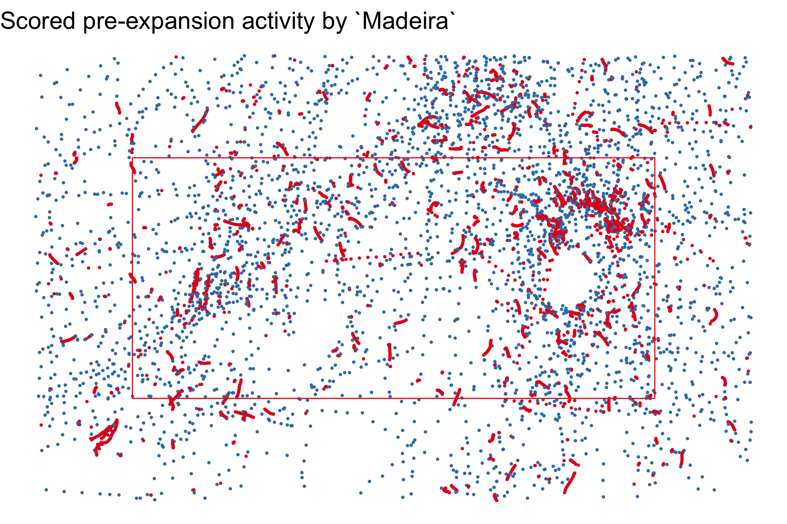
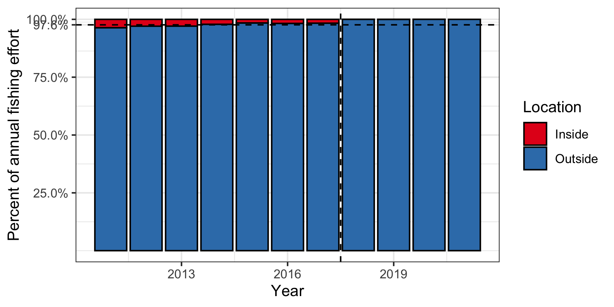
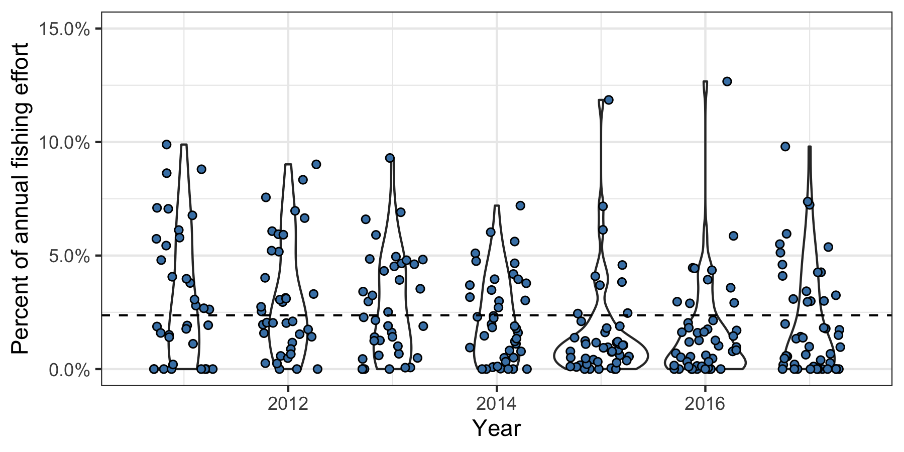
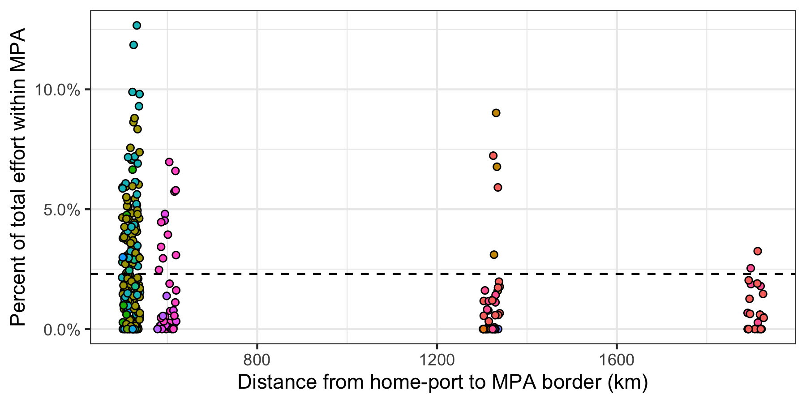
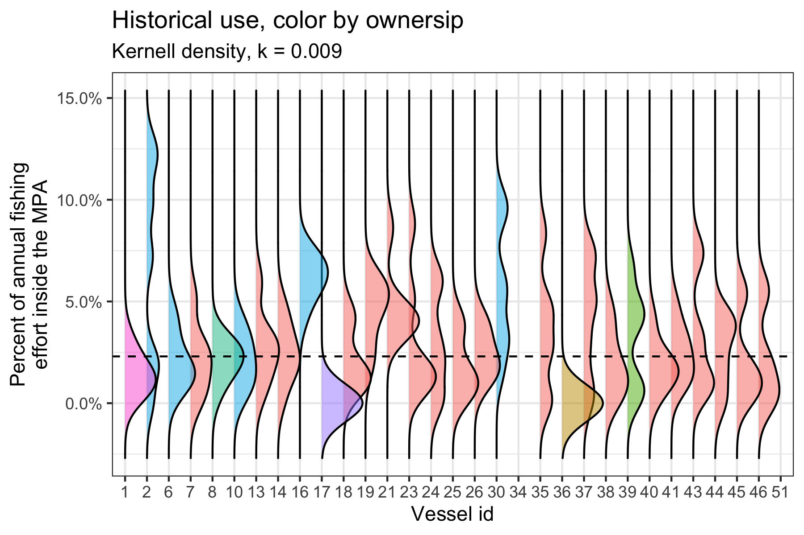

```{r, echo = F, include = F, warnings = F}
knitr::opts_chunk$set(echo = F,
                      warnings = F,
                      message = F,
                      out.width = 750,
                      fig.align = "center")

library(xaringanthemer)

style_mono_accent(
  base_color = "#1c5253",
  header_font_google = google_font("Josefin Sans"),
  text_font_google   = google_font("Roboto", "400", "300i", "300b"),
  code_font_google   = google_font("Fira Mono"),
  header_h1_font_size = "2.2rem",
  header_h2_font_size = "2rem",
  text_font_size = "1.1rem",
  link_color = "#808080",
  header_background_auto = T,
  footnote_font_size = "0.75rem"
)
```

# Before we begin

- We'll be looking at ocean space

--

- Motivated by past MPA and vessel displacement

--

- NOT about MPA displacement (I think)

---
# Aggregate effort displacement
## Expansion of Papahanaumokuakea

.footnote[Lynham et al., 2020]

```{r, out.width = 400}
knitr::include_graphics("img/monuments.png")
```

---
# Aggregate effort displacement
## Phoenix Island Protected Area

.footnote[Villaseñor-Derbez et al., 2020]

```{r, out.width = 500}
knitr::include_graphics("img/pna.png") 
```


---
# What's the question?

--
Not sure, but...

--

## Why do fishers fish where they fish?

<br>

--

- Understanding _why_ processes arise is interesting

<br>

--

- Understanding this will be relevant for MSP:

  - Offshore wind farms
  
  - Offshore aquaculture
  
  - Ocean energy harvesting

---
# Thoughts

I think it's an interaction between proximity (low cost of exploring) and ability / knowledge / proficiency

<br>

--

> ###For any given patch of ocean in the world, who fishes there will be determined by their access and ability to fish it

--

<br>

I don't think the examples above have the data I need to explore this

---
# Revillagigedo (*Revilla*) - Old polygon

```{r}
 
```

---
# Revillagigedo (*Revilla*) - Expansion (2017)

```{r}
knitr::include_graphics("../../results/img/map_new_revilla.png") 
```

---
# I do have some data

- Mexico requires vessels > 10m to have a government-issued GPS

--

- A bunch of benefits come with it

--

- Tracking data are available (2011-2021)

  - Hourly position for ~2,500 vessels

--

- Lots of info on vessel info

  - size
  
  - crew
  
  - gear
  
  - ownership

---
# Tuna purse seining activity (55 vessels)

```{r, out.width=1000}

```

---
# Today

- What positions are fishing vs transiting?

--

- What is the historical use of Revilla?

--

- How does this vary across vessels?

--

- What might drive this variation?

---
# In-house ML

```{r}
knitr::include_graphics("../../results/img/most_unclassified_before.png")
```


---
# In-house ML

```{r}
 
```


---
# Historical use (aggregate)

--

On average, only 2.3% of fishing effort occurred within the expanded MPA

```{r}
 
```

---
# Historical use (individual)

--

Some vessels are well above 2.3%

```{r}
 
```

---
# Is it proximity?

--
That's what it looks like

```{r}

```

--

Let's look into those


---
# Zoom in to equi-distant vessels

```{r}

```


<!-- --- -->
<!-- # Why heterogeneity within the same vessels? -->

<!-- --- -->
<!-- # Nothing special about Revilla -->

<!-- If you were to draw a polygon anywhere in the ocean, I bet you would observe similar patterns -->


---
# Thoughts


$$\Pi_t = pqE_tX_t - cE_t^\beta$$

And

$$X_{t+1} = X_t + rX_t (\frac{K - X_t}{K}) - H_t$$


--

$$\Pi_{it} = \sum_{j = 1}^J \left(pq_{ij}E_{ijt}X_j - cE_{ijt}^\beta\right)$$

--

I think $q_{ij}$ can be learned in time, thus:

$$q_{ijt} = k_j \theta_{it}$$

--

With

$$\theta = f(theta_{ijt-1}, \text{visitation}, \text{distance})$$

---
# Thoughts

Learning-by-doing setting

Learning is costly
