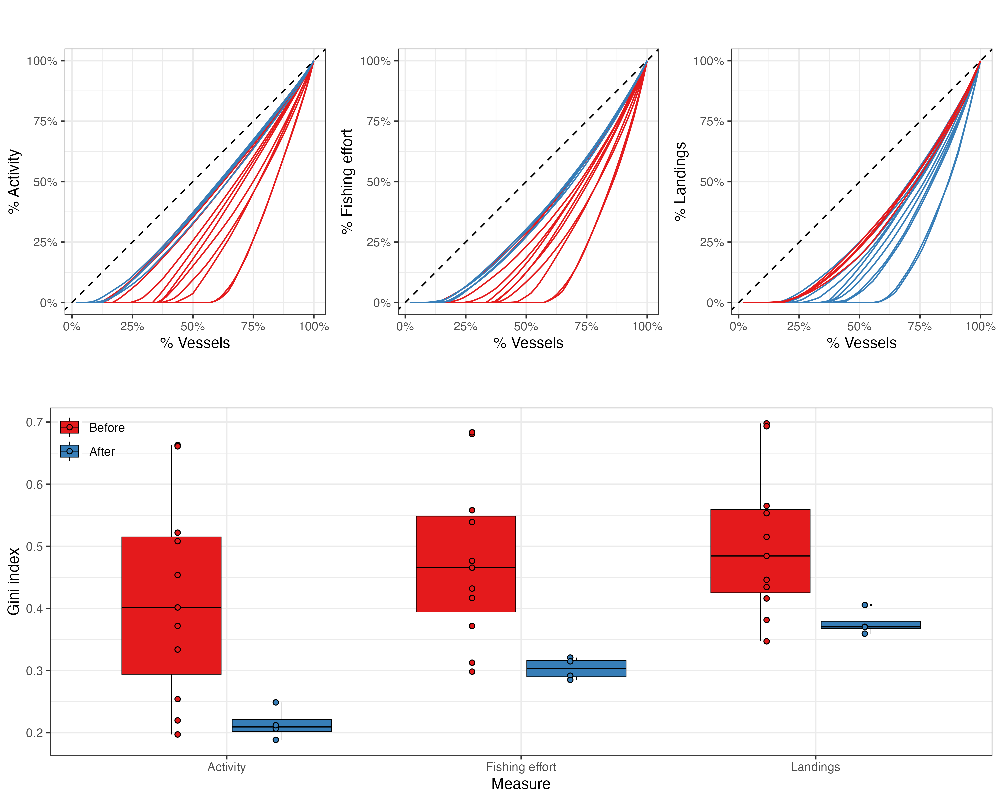
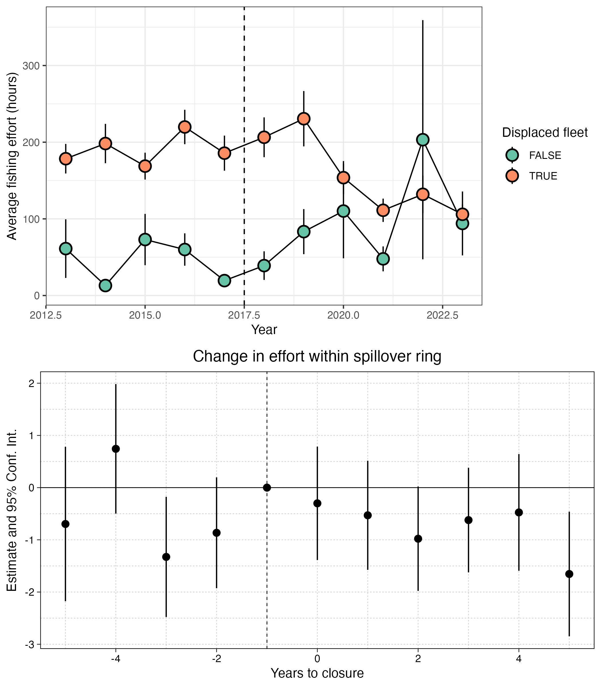
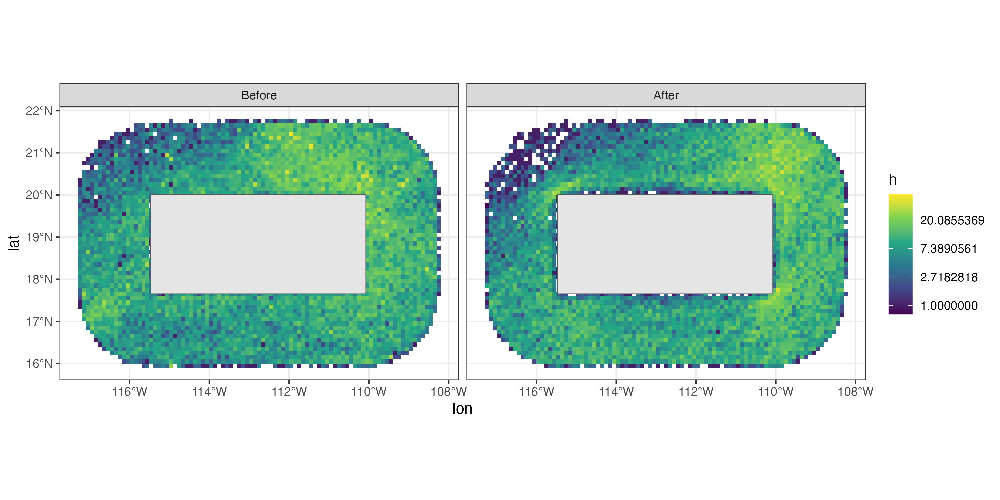
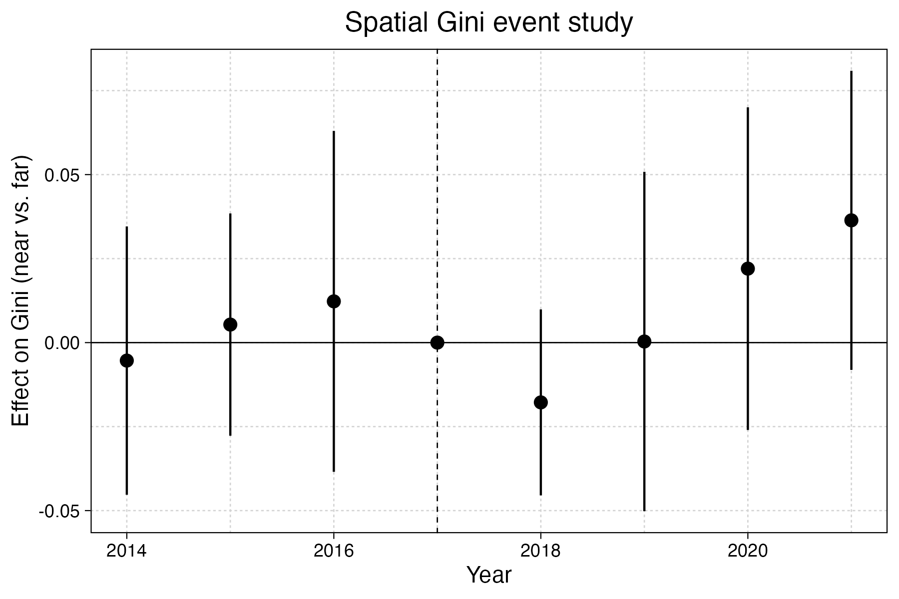

## Overview

This report summarizes the effects of the 2017 expansion of the Revillagigedo Islands Marine Protected Area (MPA) on the spatial distribution and inequality of fishing effort by Mexico's tuna fleet. Vessels are classified as *displaced* (>1% of pre-expansion fishing effort inside the new MPA boundary) or *not displaced*. We use VMS tracking data from 2013--2023 to measure changes in effort, spatial concentration (Gini coefficients), and fishing ground extent.

## Inequality in fishing effort

Lorenz curves show that fishing effort and landings are highly concentrated among a small share of vessels. Gini coefficients remain elevated before and after the expansion, with no clear shift in fleet-wide inequality (@fig-lorenz).

{#fig-lorenz}

## Changes in effort within the spillover ring

Within the 100 nautical mile spillover ring around Revillagigedo, displaced vessels show a sharp decline in effort following the 2017 closure, while non-displaced vessels maintain or increase their activity (@fig-effort-combined). The event study model confirms a significant negative effect on displaced vessels' effort relative to the pre-expansion baseline, with no evidence of differential pre-trends.

{#fig-effort-combined}

## Spatial redistribution

The spatial distribution of fishing effort in the spillover ring shifted after the expansion. @fig-spatial-effort shows effort concentrations moving away from the former MPA area in the post-expansion period.

{#fig-spatial-effort}

## Spatial inequality

Spatial Gini coefficients---measured at 0.5-degree resolution within 200 nautical miles of the MPA---show localized changes in inequality. @fig-delta-gini maps the change in Gini between the pre- and post-expansion periods. Cells near the MPA tend to show increased concentration, consistent with effort being compressed into a smaller area.

{#fig-delta-gini}

The event study on spatial Gini confirms that cells near the MPA (within 100 nm) experienced a relative increase in inequality compared to cells farther away (@fig-gini-es).

{#fig-gini-es}
